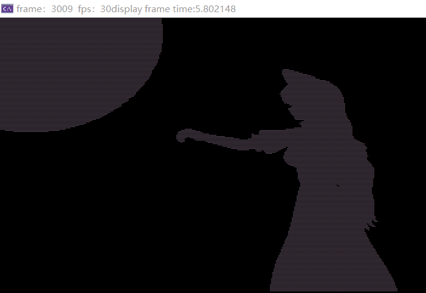
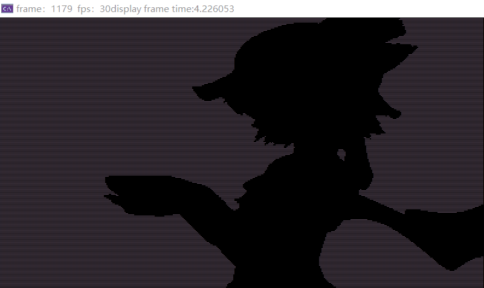

# Console Video Player

## Introduction

A console-based video player that decodes video using the OpenCV library and displays it in the console using characters. Adjustable options include frame rate, video size, and more.

## Result

